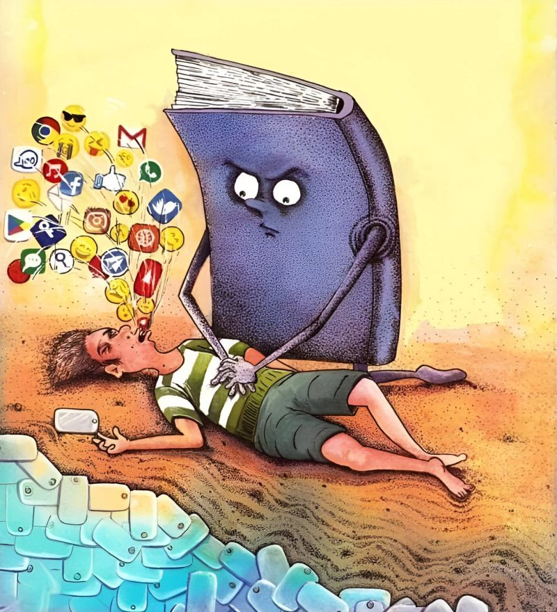

# 📰 Reals



> Print your Instagram Reels feed. Put down your phone. Read instead.

Reals is a local Python tool that scrolls your Instagram Reels feed, screenshots each post, uses AI to summarize video content, and generates a printable PDF — like a personal zine of your feed.

The idea: instead of doomscrolling before bed, you print your Reals and read them offline.

---

## How it works

1. A Playwright browser opens Instagram Reels
2. It scrolls through your feed, screenshotting each reel
3. Vision AI reads each screenshot — extracting the username, caption, and writing a one-line summary of the video content
4. Everything gets laid out into a clean, printable PDF

---

## Setup

**Requirements**

- Python 3.9+
- An AI API key

**Install**

```bash
git clone https://github.com/yourusername/reals
cd reals
pip install playwright anthropic fpdf2 pillow python-dotenv PyQt5
playwright install chromium
```

**Set your API key**

Create a `.env` file in the project root:

```bash
cp .env.example .env
```

Then open `.env` and add your key:

```
AI_API_KEY=your_key_here
```

---

## Usage

**Desktop app (recommended)**

```bash
python app.py
```

A window will open with a slider to choose how many reels to capture, a dry run toggle, and a live log. Click **Print my Reals →** and it handles the rest.

**CLI**

```bash
# Full run — opens browser, screenshots feed, generates PDF
python main.py

# Dry run — skips AI calls, uses dummy data (free, good for testing layout)
python main.py --dry-run

# Custom count
python main.py --count 12
```

On first run, a browser window will open. Log into Instagram normally, then press **Enter** in the terminal. Your session is saved locally so you won't need to log in again.

Your `reals.pdf` will appear in the project folder. Print it out.

---

## Privacy

Everything runs locally on your machine. Your Instagram session, screenshots, and feed data never leave your computer. The only external call is to the AI API to process screenshots.

Make sure `session.json` and `screenshots/` are in your `.gitignore` — they're already excluded if you clone this repo.

---

## Project structure

```
reals/
├── app.py            # desktop GUI (PyQt5)
├── main.py           # CLI entrypoint, --dry-run --count flags
├── scraper.py        # Playwright browser automation
├── ai_processor.py   # Vision API calls
├── pdf_builder.py    # PDF layout and export
├── .env.example      # copy to .env and add your API key
├── requirements.txt
└── .gitignore        # includes .env, session.json, screenshots/
```

---

## Limitations

- Video content is captured as a still frame + AI summary (you can't print a video)
- Instagram's UI changes occasionally — selectors may need updating
- Intended for personal use. Running this at scale would violate Instagram's ToS

---

## Why

Average person spends 2+ hours a day on social media, much of it passively scrolling. Reals doesn't try to stop you from consuming your feed — it just moves it off your phone and onto paper.

Built at a hackathon in 4 hours.

---

## License

MIT
